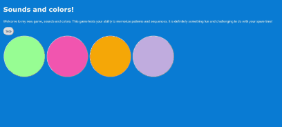

# *Sounds and colors*

**Sounds and colors** is an app is an app that allows the user to test their memory by recalling patterns of colors and sounds features include starting and stopping the game, producing clues and shapes that produce sounds on click

Submitted by: **Osaze Imohe**

Time spent: **8** hours spent in total

## User Stories

The following **required** functionality is completed:

* [x] User can **click button that prompts the game to start and stop**
* [x] User can **both produce sounds and change the color of shapes by clicking them** 
* [x] User's **receive a sequence of clues** consisting of varying patterns of sounds and shapes

The following **optional** features are implemented:

* [ ] User can **click more than four game buttons** 
* [ ] User will **Speed up the game with time** 
* [ ] User will **be provided with a random secret pattern**
* [ ] User will **be given three strikes**
* [ ] User will **have a limited time to make game guesses**

**Reflection Questions** 

1. Resources I used: https://careerkarma.com/blog/javascript-document-getelementbyid-is-not-a-function/

2.A challenge I experienced while working on this submission was getting the button to toggle from start to stop when clicked. The first thing I did in this situation was to check for any mistakes in the syntax. I looked at the capitalization and punctuation in the finish game() method to make sure they were all correct. Next, I inspected the page of the game to take a look into what was being logged to the console. I got a type error saying getElementbyId() is not a function. I looked at an article online to check for the cause of the type error(). After checking my code again I noticed that  I had overlooked the lowercase “b” in “getElementbyId()” which was supposed to be uppercase. When I corrected this error the button was able to toggle from start to stop. Thereby triggering the finishgame() function

3. What questions about web development do you have after completing your submission? (recommended 100 - 300 words)
I have experience with object-oriented programming languages like Java and Python. However, I do not know how these would potentially play a role in web development. I would like to know how object-oriented programming languages play a role in web development. I would also like to know if there are any advantages of using object-oriented programming to accompany a website built with CSS, HTML, and JavaScript. Are there any disadvantages of using OOP in web development and what are they? Lastly, is it possible for a web page's interactivity to be the joint effort of two different languages? 
 
4.Something  I would love to upgrade is a different arrangement for the shapes. Arranging the circles in an inverted triangle would have made it look better. It would have also made it a little bit more challenging to identify the required pattern. However, given more time I would have made the buttons move after a certain number of guesses. For example, the game could have begun with the circles arranged in a triangle. If the player reached a certain level they would begin to slowly move across the screen. This could have been implemented by adding an if statement before the increment of progress in the guess function.This if statement would use document.getElementById.classlist.add(“move”). The created CSS function, move, use the CSS translate() to move a button across the screen to the end of the screen and back

##Interview recording link
[https://www.loom.com/share/464172ac759f4d16962bb149abd0e66b]

## Video Walkthrough

Here's a walkthrough of the features:

GIF created with [Animated gif capture](https://chrome.google.com/webstore/detail/animated-gif-capture/aecmckhhfknljgicfkpbinfkpnijehcm/related).

## License

    Copyright [2022] [Osaze Imohe]

    Licensed under the Apache License, Version 2.0 (the "License");
    you may not use this file except in compliance with the License.
    You may obtain a copy of the License at

        http://www.apache.org/licenses/LICENSE-2.0

    Unless required by applicable law or agreed to in writing, software
    distributed under the License is distributed on an "AS IS" BASIS,
    WITHOUT WARRANTIES OR CONDITIONS OF ANY KIND, either express or implied.
    See the License for the specific language governing permissions and
    limitations under the License.
